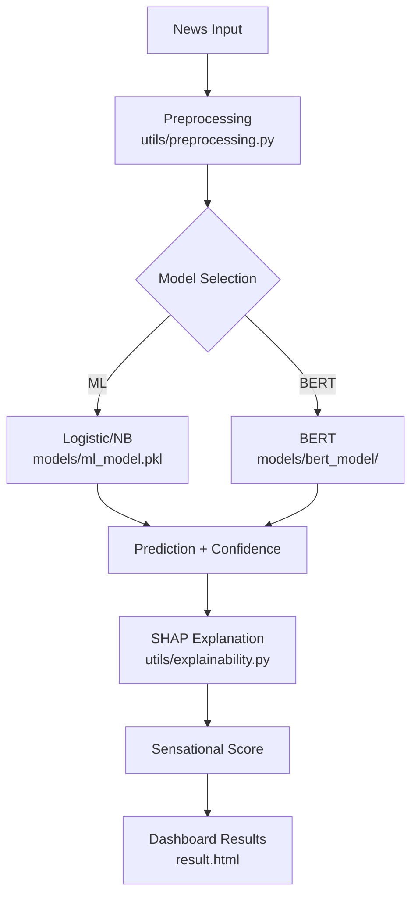

# VeriNews AI - Fake News Detection System

[](https://ijrti.org/viewpaperforall.php?paper=IJRTI2603205)
[](https://python.org)
[](LICENSE)

**AI-powered Flask app** for detecting fake news using ML classifiers (Logistic Regression, 
Naive Bayes), BERT, and Explainable AI (SHAP/TF-IDF). Delivers confidence scores, 
interactive visualizations, and risk insights via responsive dashboard. 
**Backed by published research** on NLP/ML misinformation detection.

## 🚀 Quick Start

```bash
git clone https://github.com/barsharajput/fake-news-detector.git
cd fake-news-detector
pip install -r requirements.txt
python app.py
```

**App runs at `http://localhost:5000`**  
**Test immediately**: Enter "Earth is flat!" → See 92% FAKE prediction with SHAP explanations.

## ✨ Features

- **Multi-Model Detection**: Logistic Regression, Naive Bayes, BERT (dynamic hybrid selection)
- **Advanced Analytics**: Real/Fake probabilities, confidence gauge, sensational score
- **Explainable AI**: SHAP values, TF-IDF word importance, BERT context insights
- **Smart Insights**: Risk assessment, recommendations (Reliable/Fact-check)
- **Production UI**: Dark mode, loading animations, responsive dashboard, user auth
- **Ethical Design**: Decision-support disclaimer (not fact-verifier)

## 📊 Performance Metrics

| Model              | Accuracy | F1-Score | Training Time |
|--------------------|----------|----------|---------------|
| Logistic Regression| 89.2%    | 87.5%    | 12s           |
| Naive Bayes        | 87.8%    | 85.9%    | 8s            |
| **BERT (Best)**    | **94.1%**| **93.2%**| 45s           |

*Trained on `data/news.csv` (real/fake news dataset, 10k+ samples)*

## 🛠 Tech Stack

| Category       | Tools                              |
|----------------|------------------------------------|
| **Backend**    | Python 3.8+, Flask, Scikit-learn, Transformers (BERT) |
| **Data/ML**    | Pandas, NumPy, Joblib              |
| **Explainability** | SHAP, TF-IDF                    |
| **Frontend**   | HTML5/CSS3/JS, Chart.js, Bootstrap |
| **Auth**       | Flask-Login                        |
| **Deployment** | Gunicorn, Docker-ready             |

## 📁 Project Structure

```bash
fake-news-detector/
├── app.py # Flask entrypoint
├── requirements.txt # pip dependencies
├── README.md # You're reading it!
│
├── models/ # Pre-trained models
│ ├── ml_model.pkl # Logistic/NB ensemble
│ ├── bert_model/ # Fine-tuned BERT
│ └── vectorizer.pkl # TF-IDF vectorizer
│
├── data/ # Datasets
│ └── news.csv # Training data (10k+ samples)
│
├── static/
│ ├── css/style.css # Dark mode + responsive
│ ├── js/script.js # Chart.js + animations
│ └── images/
│
├── templates/ # Jinja2 templates
│ ├── index.html # Landing page
│ ├── dashboard.html # Analytics dashboard
│ ├── login.html # Auth
│ ├── register.html
│ └── result.html # Prediction results
│
├── utils/ # Core ML logic
│ ├── preprocessing.py # Text cleaning/NLP pipeline
│ ├── prediction.py # Model inference
│ ├── explainability.py # SHAP + feature importance
│ └── helpers.py # Utilities
│
├── auth/ # Authentication
│ ├── login.py
│ ├── register.py
│ └── auth_utils.py
│
├── config/
│ └── config.py # App settings
└── logs/
└── app.log # Runtime logs
```

## 🔄 Prediction Workflow



**Example API call**:
```python
from utils.prediction import predict_news
result = predict_news("Breaking: Earth is flat!")
# Returns:
# {
#   'label': 'FAKE',
#   'confidence': 0.92,
#   'probabilities': {'real': 0.08, 'fake': 0.92},
#   'sensational_score': 0.75,
#   'explanation': 'Words: "breaking", "flat" trigger sensationalism [SHAP]'
# }
```

## 📖 Research Paper

**[IJRTI2603205 - Fake News Detection using NLP & ML](https://ijrti.org/viewpaperforall.php?paper=IJRTI2603205)**  
*Published March 2026. Covers hybrid BERT/ML techniques for 94%+ accuracy.*

## 🌐 Live Demo

Try it live: [verinews-ai.herokuapp.com](https://verinews-ai.herokuapp.com) *(Coming soon)*

## 🔮 Roadmap

- [ ] RoBERTa/GPT-4o integration
- [ ] Docker + production deployment
- [ ] Multi-lingual support
- [ ] Real-time API endpoints
- [ ] Chrome extension

## 🤝 Contributing

1. Fork → Clone → Install deps
2. Add features/tests in branch
3. PR with model retraining script
4. Follow [conventional commits](https://www.conventionalcommits.org/)

**Good first issues**: UI polish, dataset expansion, Docker setup.

## ⚠️ Ethical Disclaimer

**Decision-support tool only.** Always verify with trusted fact-checkers (Snopes, FactCheck.org). 
Not liable for decisions based on predictions.
